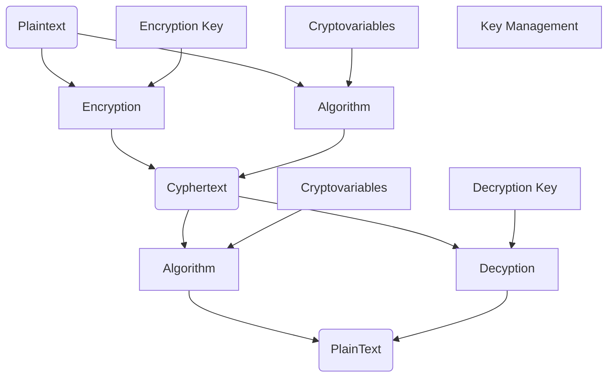

2026-05-15 17:36
Status: #InProgress

## Notes
### Encryption
- Process of turning *plaintext(The original data)* into *Cyphertext(not human readable, hopefully not intelligible to computers too)* 
- 
### Confidentiality Through Cryptography
- Cryptography hides or obscures data from unauthorized access
### Integrity Through Cryptography
- a *Hash* is an encrypted digest of a message used to verify if it has been un changed from it's original state (fixed length output)
- *Digital signatures*
### Diagram of Encryption

 
## See also
- link back to main index