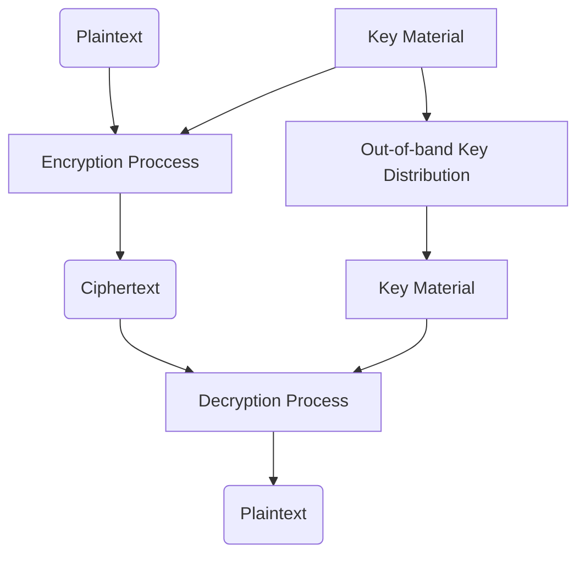
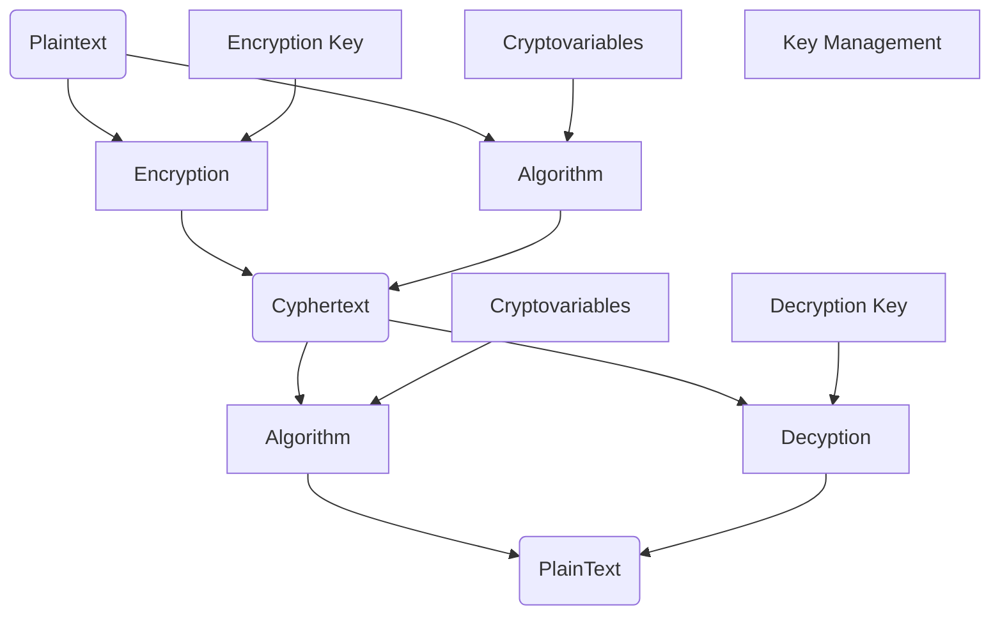

2026-05-15 17:36
Status: #InProgress

## Notes
### Encryption
- Process of turning *plaintext(The original data)* into *Cyphertext(not human readable, hopefully not intelligible to computers too)* 
- *Cryptography* is the practice of securing communications though encryption
- *Encryption System* a system that through hardware, software, algorithms, control parameters, and operational methods, provides a set of cryptographic services
#### Symmetric Encryption
- involves one key used for both encryption and decryption
- faster and less overhead
- less secure
##### Other names for Symmetric Algorithms
- Shared Key
- Single Key
- Secret Key
- Session Key
- Same Key
##### Primary uses of Symmetric Algorithms
- Encrypting bulk data (backups and such)
- Encrypting messages traversing communications (IPSec, TLS)
- Streaming Large-scale time sensitive data (gaming,videos,audio)
##### Challenges with Symmetric Encryption
- if both parties have to have the key to talk privately, how do they share it?
	- if sent through the same "band" or line of comms a MITM(Man in The Middle) attack could get the key
	- *Out-of-Band* key distribution is sharing the key via another band/line of comms 
- each individual/group wanting to communicate needs their own key which is bad for scalability
	- 1000 users means roughly 500K keys for each to have secure lines of comms with each other
##### Diagram of Symmetric Encryption

#### Asymmetric Encryption
- involves 2 keys 
	- *public*
	- *private*
	- one key is used for encryption and another is used for decryption
- slower and more resource intensive
- more secure
##### Using an Asymmetric Algorithm
- first generate a key pair
	- often done through an cryptographic application or the *PKI(Public Key Infrastructure)*
	- the keys in the key pair are mathematically related, but the math is left to cryptanalysts and cryptographers
##### Key pair
- half of the key pair is kept secret; that is the user's *private key*
- the second half of this key pair is the user's *public key*, which companies often make publicly available on their corporate website or key server
- Anyone can encrypt something using the recipient's *public key* but only the recipient can decrypt it via their *private key*
##### What does problems does Asymmetric key Encryption solve?
- Key distribution; allows a message to be sent across a insecure medium securely, also no overhead concerning prior key distribution
- Non-repudiation; for both origin and delivery
- Scalability; an org with 100,000 employees only needs 200,000 keys, one key pair per employee
##### What does problems does Asymmetric key Encryption introduce?
- Speed; asymmetric encryption is giga slow and not viable for large data transfers or frequent data transfers
##### How Asymmetric key Encryption achieves security attributes
- key pairs must be used together 
### Confidentiality Through Cryptography
- Cryptography hides or obscures data from unauthorized access
### Integrity Through Cryptography
- a *Hash* is an encrypted digest of a message used to verify if it has been un changed from it's original state (fixed length output)
	- hashed code is often set as a *checksum* to verify it's integrity
- *Digital signatures*
### Diagram of Encryption

 
## See also
- [Security Operations](sec-ops-index.md)