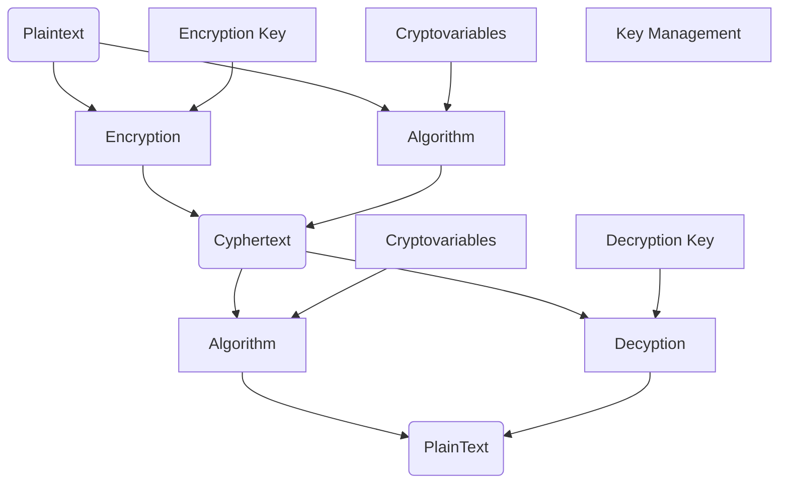

2026-05-15 17:36
Status: #InProgress

## Notes
### Encryption
- Process of turning *plaintext(The original data)* into *Cyphertext(not human readable, hopefully not intelligible to computers too)* 
- *Cryptography* is the practice of securing communications though encryption
- *Encryption System* a system that through hardware, software, algorithms, control parameters, and operational methods, provides a set of cryptographic services
#### Asymmetric Encryption
- involves 2 keys 
	- public
	- private
- slower and more resource intensive
- more secure
#### Symmetric Encryption
- involves one key used for both encryption and decryption
- faster and less overhead
- less secure
##### Challenges with Symmetric Encryption
- if both parties have to have the key to talk privately, how do they share it?
	- if sent through the same "band" or line of comms a MITM(Man in The Middle) attack could get the key
	- *Out-of-Band* key distribution is sharing the key via another band/line of comms 
- each individual/group wanting to communicate needs their own key which is bad for scalability
	- 1000 users means roughly 500K keys for each to have secure lines of comms with each other
##### Diagram of Symmetric Encryption

### Confidentiality Through Cryptography
- Cryptography hides or obscures data from unauthorized access
### Integrity Through Cryptography
- a *Hash* is an encrypted digest of a message used to verify if it has been un changed from it's original state (fixed length output)
	- hashed code is often set as a *checksum* to verify it's integrity
- *Digital signatures*
### Diagram of Encryption

 
## See also
- [Security Operations](sec-ops-index.md)